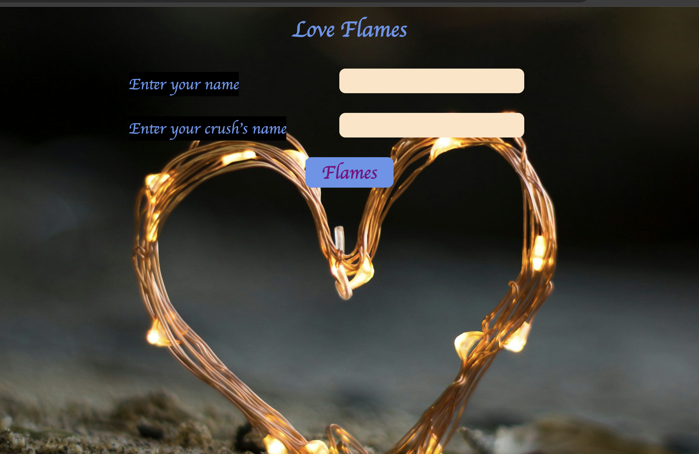
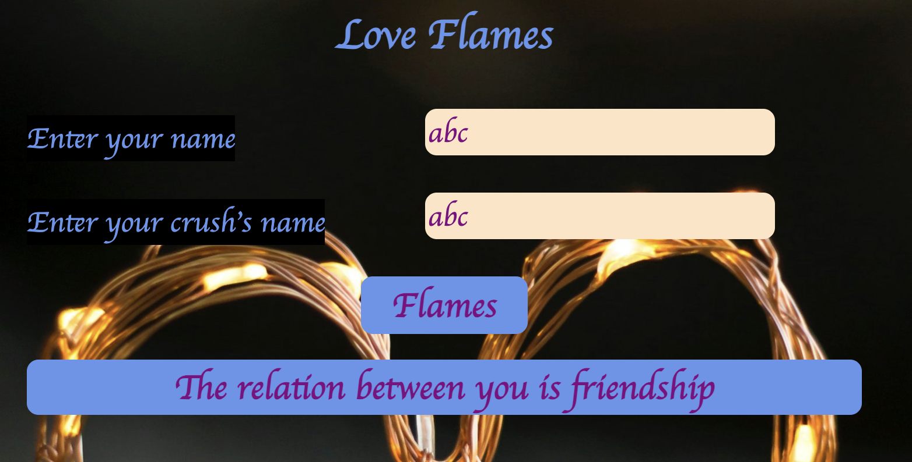

# LoveFlames Game
The FLAMES game is a popular pastime in India that playfully assesses the potential relationship between two individuals. The game's acronym, FLAMES, stands for Friendship, Love, Affection, Marriage, Enmity, and Siblinghood, representing various types of relationships. Participants enter their names, and the game generates a fun evaluation based on the input.

# Feautures
* This game is a single page static web application with no page reloads.
* Simple form with proper validations ensures that all fields are filled.
* Light weight application,page loads quickly and user gets immediete access to its content.

# Technologies used
* JavaScript
* HTML
* CSS

# Usage
The functionality of this game is straightforward and engaging. Users are prompted to enter their name along with their crush's name. The script then performs a series of mathematical calculations based on the provided names to generate an entertaining assessment of their relationship compatibility.

# Screenshots
This is the screenshot of homepage

This screenshot shows validations

This screenshot the final result

